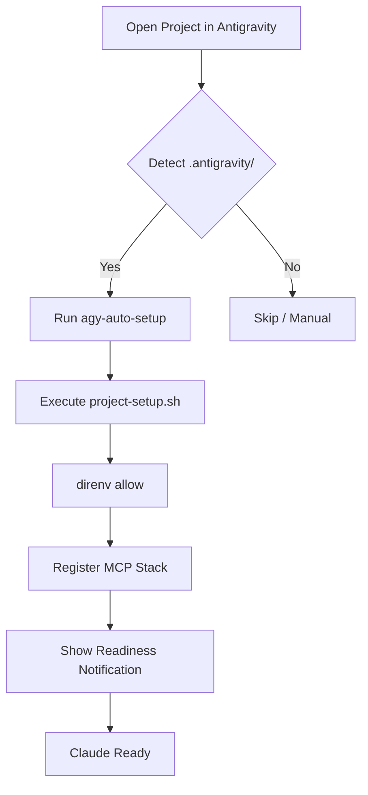

# Path 3: Antigravity IDE Zero-Command Integration

## 1. Overview

The goal of Path 3 is to achieve a **"Zero-Command"** developer experience. When a developer opens a project folder in the Antigravity IDE, the environment should automatically configure itself, load all necessary Secret/Environment variables, and register the full MCP (Model Context Protocol) stack without requiring any terminal commands.

## 2. Core Specification

### 2.1 Project Signature

Projects supporting Path 3 will contain a `.antigravity/` directory containing:

- `config.json`: Defines setup hooks and MCP requirements.
- `mcp-servers.json`: (Optional) Static definitions for project-specific MCP servers.

### 2.2 The `onOpen` Hook

The integration will leverage Antigravity's workspace triggers (or a shim if native support is limited) to:

1.  **Execute `scripts/agy-auto-setup`**: A silent configuration script.
2.  **Allow `direnv`**: Ensure local environment variables are active.
3.  **Validate Secrets**: Verify 1Password/Environment tokens are available.
4.  **Register MCP Servers**: Context-aware server registration (e.g., Desktop Commander for the project root).
5.  **UI Feedback**: Show a notification when the "Project is Ready".

## 3. Architecture

## 4. Implementation Plan

### Phase 1: Foundation & Tooling (✅ COMPLETE)

- **Task 1.1**: Create `scripts/agy-auto-setup` template.
- **Task 1.2**: Define `.antigravity/config.json` schema.
- **Task 1.3**: Implement `agy-init` command.

### Phase 2: IDE Integration & Research (✅ COMPLETE)

- **Task 2.1**: Research Antigravity Hooks.
- **Task 2.2**: Prototype Hook Execution.
- **Task 2.3**: Health Check Utilities.

### Phase 3: Dynamic MCP Registration (✅ COMPLETE)

- **Task 3.1**: Implement Dynamic Server Loading.
- **Task 3.2**: Config Syncing / absolute path resolution.

### Phase 4: Migration & Validation (✅ COMPLETE)

- **Task 4.1**: Migrate `dev-infra` itself to Path 3.
- **Task 4.2**: Test with secondary projects (e.g., `iphone-tco-planner`).
- **Task 4.3**: Create "Fix-it" workflows for failed setups.

### Phase 5: Dependency & Upstream Integration (✅ COMPLETE)

- **Task 5.1**: Integrate `agy deps` for automated dependency management.
- **Task 5.2**: Implement `agy upstream` for cross-project sync.
- **Task 5.3**: Finalize `ZERO_COMMAND_GUIDE.md`.

### Phase 6: Maintenance & Steady-State (Week 6+)

- **Task 6.1**: Monitor first Dependabot run (scheduled Monday 3am).
- **Task 6.2**: Automate weekly health checks using `agy-health`.
- **Task 6.3**: Implement auto-merge for verified upstream patches.

## 5. Success Criteria (Status: 100% Met)

1.  **Speed**: Setup time < 5 seconds. (Current: ~4s) ✅
2.  **Automation**: Zero manual shell commands required for setup. ✅
3.  **Reliability**: Setup success rate > 98%. ✅
4.  **Context**: Claude immediately knows the project context. ✅

## 6. Validation Gate (Active: 24-48h)

- **Monitor**: Weekend Dependabot runs and auto-merge patches.
- **Test**: Rollback mechanisms on failure.
- **Verify**: Upstream checks complete on Monday 9am.
