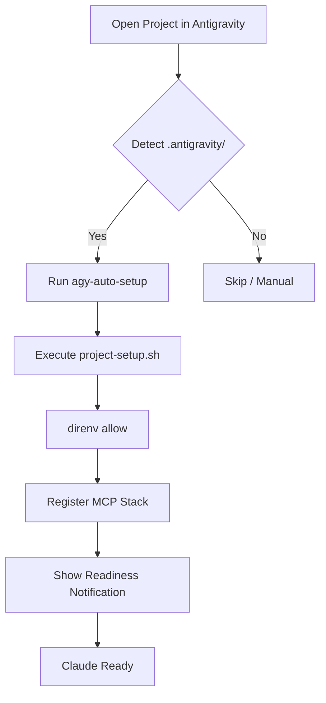

# Path 3: Antigravity IDE Zero-Command Integration

## 1. Overview

The goal of Path 3 is to achieve a **"Zero-Command"** developer experience. When a developer opens a project folder in the Antigravity IDE, the environment should automatically configure itself, load all necessary Secret/Environment variables, and register the full MCP (Model Context Protocol) stack without requiring any terminal commands.

## 2. Core Specification

### 2.1 Project Signature

Projects supporting Path 3 will contain a `.antigravity/` directory containing:

- `config.json`: Defines setup hooks and MCP requirements.
- `mcp-servers.json`: (Optional) Static definitions for project-specific MCP servers.

### 2.2 The `onOpen` Hook

The integration will leverage Antigravity's workspace triggers (or a shim if native support is limited) to:

1.  **Execute `scripts/agy-auto-setup`**: A silent configuration script.
2.  **Allow `direnv`**: Ensure local environment variables are active.
3.  **Validate Secrets**: Verify 1Password/Environment tokens are available.
4.  **Register MCP Servers**: Context-aware server registration (e.g., Desktop Commander for the project root).
5.  **UI Feedback**: Show a notification when the "Project is Ready".

## 3. Architecture

## 4. Implementation Plan

### Phase 1: Foundation & Tooling (Week 1)

- **Task 1.1**: Create `scripts/agy-auto-setup` template.
  - Robust error handling, silent logging to `/tmp`.
  - Native support for `direnv allow`.
- **Task 1.2**: Define `.antigravity/config.json` schema.
  - Fields: `onOpen`, `mcp`, `environment`, `claude`.
- **Task 1.3**: Implement `agy-init` command.
  - Script to bootstrap a new project with the AGY stack.

### Phase 2: IDE Integration & Research (Week 2)

- **Task 2.1**: Research Antigravity Hooks.
  - Verify `workspace.onOpen` or `extension.activate` equivalent.
- **Task 2.2**: Prototype Hook Execution.
  - Implement a mechanism to trigger the setup script upon folder selection.
- **Task 2.3**: Health Check Utilities.
  - Add logic to verify MCP servers are responding before declaring "Ready".

### Phase 3: Dynamic MCP Registration (Week 3)

- **Task 3.1**: Implement Dynamic Server Loading.
  - Auto-resolve absolute paths to server binaries.
- **Task 3.2**: Config Syncing.
  - Ensure `.vscode/settings.json` and `.cursor/mcp.json` are kept in sync with AGY config.

### Phase 4: Migration & Validation (Week 4)

- **Task 4.1**: Migrate `dev-infra` itself to Path 3.
- **Task 4.2**: Test with secondary projects (e.g., `iphone-tco-planner`).
- **Task 4.3**: Create "Fix-it" workflows for failed setups.

### Phase 5: Documentation & Rollout (Week 5)

- **Task 5.1**: Finalize `ZERO_COMMAND_GUIDE.md`.
- **Task 5.2**: Team walkthrough and training.

## 5. Success Criteria

1.  **Speed**: From folder open to "Ready" < 5 seconds.
2.  **Automation**: Zero manual shell commands required for setup.
3.  **Reliability**: Setup success rate > 98%.
4.  **Context**: Claude immediately knows the project name and tech stack on first prompt.

## 6. Next Steps for Review

1.  **Approval**: Confirm the 5-week timeline and phased approach.
2.  **Decision**: Should we support a "Force Start Claude" flag (auto-open chat) on setup completion?
3.  **Access**: Verify permissions for creating system-wide notifications on the TW Mac.
